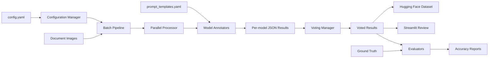
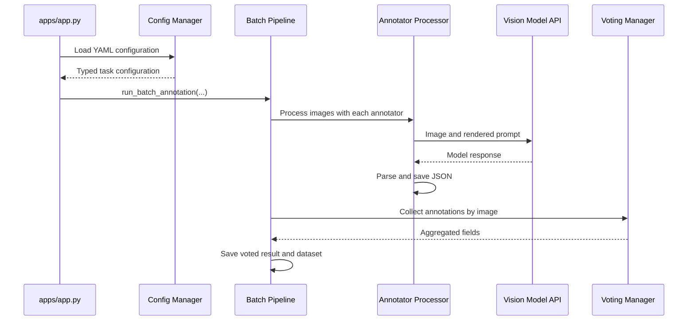

# Architecture

OpenLLM OCR Annotator is a batch-oriented annotation pipeline for extracting structured information from document images with multimodal large language models. It coordinates model providers, normalizes their responses, ensembles multiple annotations, evaluates quality, and optionally creates a Hugging Face dataset.

The project does not train an OCR model. Its primary responsibility is producing and validating annotation data.

## System Overview



The main command-line entry point is `apps/app.py`. It loads a YAML configuration and delegates the complete workflow to `run_batch_annotation`.

## Package Structure

| Area | Responsibility |
| --- | --- |
| `apps/` | Command-line and Streamlit entry points |
| `annotators/` | Provider-specific multimodal model adapters |
| `config/` | YAML parsing, validation, and typed configuration objects |
| `pipeline/` | Batch orchestration, concurrency, caching, and persistence |
| `voters/` | Majority and confidence-weighted result aggregation |
| `evaluators/` | Field accuracy and repeated-sampling evaluation |
| `utils/` | Prompt loading, formatting, image discovery, retries, and dataset conversion |

## Configuration Layer

`AnnotatorConfigManager` reads the task configuration and creates four dataclass-based configuration objects:

- `TaskConfig` describes input, output, limits, and worker settings.
- `AnnotatorConfig` describes one model adapter and its model parameters.
- `EnsembleConfig` selects the voting strategy.
- `DatasetConfig` controls Hugging Face dataset generation.

Unknown keys produce warnings. Enabled annotators are filtered before the pipeline starts.

Credentials should normally come from environment variables. An explicit `api_key` or `base_url` in an annotator configuration is passed directly to the provider adapter and takes precedence over provider defaults.

## Annotation Pipeline

The batch pipeline follows these stages:

1. Create `<output_dir>/<task_id>`.
2. Discover supported image files in `input_dir`.
3. Apply `max_files` when a positive limit is configured.
4. Run all enabled annotators.
5. Collect persisted annotations for each image.
6. Apply the configured ensemble strategy.
7. Save voted results.
8. Optionally convert voted results into a Hugging Face dataset.



Failures for an individual image are logged and normally do not stop processing other images. A failure at the outer task level is logged and re-raised.

## Throughput Model

The pipeline no longer manages its own annotator-level concurrency. Image batches are passed into the selected annotator implementation, and curator-backed annotators rely on curator's own request scheduling and rate-limit controls.

For curator-backed annotators, throughput is governed by curator backend parameters such as:

- `max_requests_per_minute`
- `max_tokens_per_minute`

Local memory usage and provider limits should still be considered when raising those values.

## Annotator Interface

All annotators implement `BaseAnnotator`:

```python
class BaseAnnotator(ABC):
    @classmethod
    @abstractmethod
    def from_config(cls, config: AnnotatorConfig):
        ...

    @abstractmethod
    def annotate(self, image_path: str) -> dict:
        ...
```

Currently instantiated adapter types are:

- `openai`
- `claude`
- `gemini`
- `litellm`

LiteLLM provides a unified route to additional providers. Placeholder modules for other providers exist, but they are not selected by the current annotator factory.

Before an API call, images are encoded as base64 where required. Oversized images are resized while preserving their aspect ratio. Prompt templates are loaded through `PromptManager`, with provider-specific templates falling back to defaults.

## Annotation Contract

Provider responses are normalized into a JSON object containing `result`. Structured extraction expects `result.fields`:

```json
{
  "result": {
    "fields": [
      {
        "field_name": "document_number",
        "value": "CONTRACT-2025-001",
        "confidence": 0.99
      }
    ],
    "metadata": {
      "document_type": "contract"
    }
  },
  "metadata": {
    "timestamp": 1740000000
  }
}
```

The processor extracts JSON from model text, rejects empty results, adds processing metadata, and saves UTF-8 JSON.

Existing valid result files are treated as a cache. Single-sample annotations are reused without another model call. In sampling mode, all configured samples are reused only when every expected sample file exists; partial samples are regenerated.

## Output Layout

Single-sample annotations use this layout:

```text
<output_dir>/
└── <task_id>/
    ├── <annotator_name>/
    │   └── <model_name>/
    │       ├── image_001.json
    │       └── image_002.json
    └── voted_results/
        ├── image_001.json
        └── image_002.json
```

Repeated sampling adds sample directories:

```text
<annotator_name>/<model_name>/sampling[_<temperature>]/sample_<n>/
```

Voted results include task metadata and the original image path. They are the source for dataset conversion and the Streamlit review application.

## Ensemble Voting

`VotingManager` loads annotations by image stem and passes them to a voter.

### Weighted Voting

`WeightedVoter` operates on structured fields. For every candidate field value, it accumulates:

```text
annotator weight x model-reported field confidence
```

The value with the highest accumulated score wins. The output confidence is the winning score divided by the total score for that field.

When repeated samples are enabled, each sample is treated as an additional vote while retaining the configured weight of its parent annotator.

### Majority Voting

`MajorityVoter` selects the most common value for each top-level key. It is simpler than weighted voting and is not specialized for the nested `result.fields` representation.

The `highest_confidence` strategy is represented in configuration but is not implemented.

## Dataset Generation

Dataset generation runs only when ensemble mode and dataset output are both enabled.

The converter:

1. Loads voted JSON files.
2. Creates typed Hugging Face features for images, paths, fields, and metadata.
3. Splits records with a fixed random seed of `42`.
4. Saves a `DatasetDict` to disk.

A floating-point split ratio creates train and test sets. A mapping can additionally define a validation split, but all ratios must sum to `1.0`.

## Evaluation and Review

The project provides three quality-control paths:

- `apps/evaluate.py` compares prediction files with ground-truth files.
- `apps/sampling_evaluate.py` evaluates multiple samples and reports the best and mean accuracy.
- `apps/streamlit_viewer.py` supports manual review of sampled voted results.

`FieldEvaluator` calculates:

- Accuracy for each configured field
- Mean field accuracy per document
- Exact document match rate

Field-specific matchers can normalize values such as dates and currencies before comparison.

## Extension Points

### Add an annotator

1. Implement `BaseAnnotator`.
2. Add a `from_config` constructor.
3. Return responses using the standard `result` contract.
4. Register the new `type` in `create_annotator`.
5. Add prompt templates and tests.

### Add a voting strategy

1. Implement `BaseVoter`.
2. Add the strategy to `EnsembleStrategy`.
3. Instantiate it in `run_voting_and_save`.
4. Test missing fields, ties, confidence values, and repeated samples.

### Add an evaluator

Extend `BaseEvaluator`, define single-record and batch behavior, and expose it through an application entry point.

## Current Constraints

- `highest_confidence` voting is not implemented.
- Majority voting does not currently follow the same field-oriented algorithm as weighted voting.
- Ensemble thresholds such as `min_confidence` and `agreement_threshold` are parsed but not currently applied by voters.
- Dataset generation depends on voted results and is unavailable when ensemble mode is disabled.
- Output files are the persistence and cache layer; there is no database or distributed job queue.
- Process exit codes from individual annotator workers are not currently aggregated into an explicit batch failure.

These constraints are important when extending the pipeline or operating it on large production datasets.
