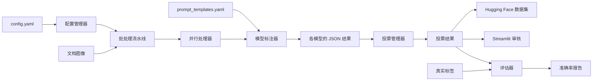
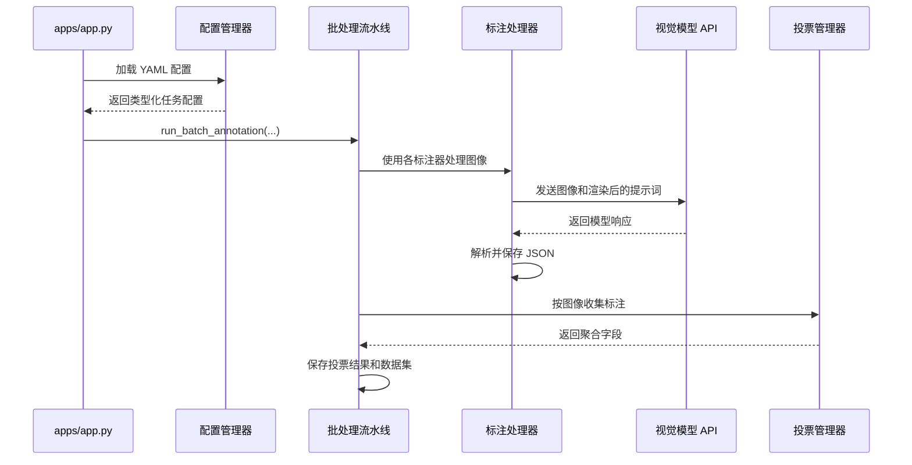

# 架构

OpenLLM OCR Annotator 是一个面向批处理的标注流水线，使用多模态大语言模型从文档图像中提取结构化信息。它负责协调模型提供商、规范化模型响应、融合多份标注、评估质量，并可选择创建 Hugging Face 数据集。

本项目不训练 OCR 模型，其主要职责是生成并验证标注数据。

## 系统概览



主要的命令行入口是 `apps/app.py`。它加载 YAML 配置，并将完整工作流交由 `run_batch_annotation` 执行。

## 包结构

| 目录 | 职责 |
| --- | --- |
| `apps/` | 命令行和 Streamlit 入口 |
| `annotators/` | 各提供商专用的多模态模型适配器 |
| `config/` | YAML 解析、验证和类型化配置对象 |
| `pipeline/` | 批处理编排、并发、缓存和持久化 |
| `voters/` | 多数投票和置信度加权的结果聚合 |
| `evaluators/` | 字段准确率和重复采样评估 |
| `utils/` | 提示词加载、格式化、图像发现、重试和数据集转换 |

## 配置层

`AnnotatorConfigManager` 读取任务配置，并创建四个基于 dataclass 的配置对象：

- `TaskConfig` 描述输入、输出、限制和工作线程设置。
- `AnnotatorConfig` 描述一个模型适配器及其模型参数。
- `EnsembleConfig` 选择投票策略。
- `DatasetConfig` 控制 Hugging Face 数据集的生成。

未知的配置键会产生警告。流水线启动前会筛选出已启用的标注器。

凭据通常应来自环境变量。在标注器配置中显式设置的 `api_key` 或 `base_url` 会直接传递给提供商适配器，并优先于提供商的默认值。

## 标注流水线

批处理流水线依次执行以下阶段：

1. 创建 `<output_dir>/<task_id>`。
2. 在 `input_dir` 中查找支持的图像文件。
3. 配置了正数限制时应用 `max_files`。
4. 运行所有已启用的标注器。
5. 收集每张图像的持久化标注。
6. 应用配置的集成策略。
7. 保存投票结果。
8. 可选择将投票结果转换为 Hugging Face 数据集。



单张图像的处理失败会被记录，通常不会中止其他图像的处理。任务外层发生的故障会被记录并重新抛出。

## 吞吐模型

流水线不再自行管理标注器级别的并发。图像批次会交给选定的标注器实现处理，而 curator 标注器则依赖 curator 自身的请求调度和限流控制。

对于 curator 标注器，吞吐主要由 curator 后端参数控制，例如：

- `max_requests_per_minute`
- `max_tokens_per_minute`

提高这些值时，仍需考虑本地内存占用和提供商限制。

## 标注器接口

所有标注器都实现 `BaseAnnotator`：

```python
class BaseAnnotator(ABC):
    @classmethod
    @abstractmethod
    def from_config(cls, config: AnnotatorConfig):
        ...

    @abstractmethod
    def annotate(self, image_path: str) -> dict:
        ...
```

目前可实例化的适配器类型包括：

- `openai`
- `claude`
- `gemini`
- `litellm`

LiteLLM 提供了访问其他提供商的统一路由。项目中存在其他提供商的占位模块，但当前的标注器工厂不会选择它们。

发起 API 调用前，图像会在需要时编码为 base64。尺寸过大的图像会在保持宽高比的情况下缩放。提示词模板通过 `PromptManager` 加载；如果没有提供商专用模板，则回退到默认模板。

## 标注契约

提供商响应会被规范化为包含 `result` 的 JSON 对象。结构化提取要求使用 `result.fields`：

```json
{
  "result": {
    "fields": [
      {
        "field_name": "document_number",
        "value": "CONTRACT-2025-001",
        "confidence": 0.99
      }
    ],
    "metadata": {
      "document_type": "contract"
    }
  },
  "metadata": {
    "timestamp": 1740000000
  }
}
```

处理器从模型文本中提取 JSON，拒绝空结果，添加处理元数据，并保存为 UTF-8 JSON。

已有的有效结果文件会被视为缓存。单次采样的标注会直接复用，不再调用模型。在采样模式下，只有当所有预期的样本文件都存在时才会复用全部配置样本；样本不完整时将重新生成。

## 输出布局

单次采样标注采用以下布局：

```text
<output_dir>/
└── <task_id>/
    ├── <annotator_name>/
    │   └── <model_name>/
    │       ├── image_001.json
    │       └── image_002.json
    └── voted_results/
        ├── image_001.json
        └── image_002.json
```

重复采样会增加样本目录：

```text
<annotator_name>/<model_name>/sampling[_<temperature>]/sample_<n>/
```

投票结果包含任务元数据和原始图像路径，是数据集转换和 Streamlit 审核应用的数据来源。

## 集成投票

`VotingManager` 按图像文件名主干加载标注，并将它们传递给投票器。

### 加权投票

`WeightedVoter` 对结构化字段进行操作。对于字段的每个候选值，它会累加：

```text
标注器权重 x 模型报告的字段置信度
```

累计得分最高的值胜出。输出置信度为获胜得分除以该字段的总得分。

启用重复采样时，每个样本都被视为额外的一票，同时保留其所属标注器的配置权重。

### 多数投票

`MajorityVoter` 为每个顶层键选择最常见的值。它比加权投票更简单，并未针对嵌套的 `result.fields` 表示进行专门设计。

配置中包含 `highest_confidence` 策略，但该策略尚未实现。

## 数据集生成

只有同时启用集成模式和数据集输出时，才会生成数据集。

转换器执行以下操作：

1. 加载投票后的 JSON 文件。
2. 为图像、路径、字段和元数据创建类型化的 Hugging Face 特征。
3. 使用固定的随机种子 `42` 拆分记录。
4. 将 `DatasetDict` 保存到磁盘。

浮点数形式的拆分比例会创建训练集和测试集。映射形式的配置还可以定义验证集，但所有比例之和必须为 `1.0`。

## 评估与审核

项目提供三种质量控制方式：

- `apps/evaluate.py` 对比预测文件与真实标签文件。
- `apps/sampling_evaluate.py` 评估多个样本，并报告最佳准确率和平均准确率。
- `apps/streamlit_viewer.py` 支持对采样后的投票结果进行人工审核。

`FieldEvaluator` 计算：

- 每个配置字段的准确率
- 每份文档的平均字段准确率
- 文档完全匹配率

字段专用的匹配器可以在比较前规范化日期、货币等值。

## 扩展点

### 添加标注器

1. 实现 `BaseAnnotator`。
2. 添加 `from_config` 构造函数。
3. 使用标准 `result` 契约返回响应。
4. 在 `create_annotator` 中注册新的 `type`。
5. 添加提示词模板和测试。

### 添加投票策略

1. 实现 `BaseVoter`。
2. 将策略添加到 `EnsembleStrategy`。
3. 在 `run_voting_and_save` 中实例化该策略。
4. 测试字段缺失、得票相同、置信度值和重复采样。

### 添加评估器

扩展 `BaseEvaluator`，定义单条记录和批处理行为，并通过应用入口公开。

## 当前限制

- `highest_confidence` 投票尚未实现。
- 多数投票目前没有采用与加权投票相同的面向字段算法。
- `min_confidence` 和 `agreement_threshold` 等集成阈值会被解析，但目前投票器不会应用它们。
- 数据集生成依赖投票结果，在禁用集成模式时不可用。
- 输出文件同时承担持久化和缓存层的职责；项目没有数据库或分布式任务队列。
- 各标注器工作进程的退出码目前不会聚合为明确的批处理失败。

在扩展流水线或将其用于大型生产数据集时，必须考虑这些限制。
